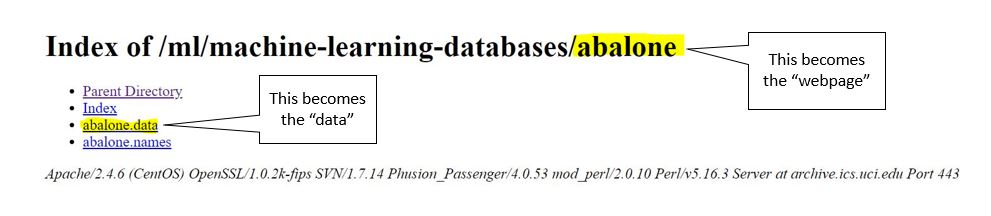

<!-- README.md is generated from README.Rmd. Please edit that file -->

# readUCI 

<!-- badges: start -->

[](https://www.tidyverse.org/lifecycle/#experimental)
[](https://CRAN.R-project.org/package=readUCI)
[](https://github.com/vivala1/readUCI/actions)
[](https://travis-ci.org/emmal73/readUCI)
<!-- badges: end -->

The [University of California Irvine Machine Learning
Repository](https://archive.ics.uci.edu/ml/datasets.php) contains 602
data sets as of 2022. These datasets are especially good for machine
learning practice, and can be used to create reproducible code examples.
As of December, 2019, there are 488 available datasets.


The challenge with using the repository is that understanding how to get
the data into R isn’t always intuitive and is inaccessible for
beginners. `readUCI` helps make this process easier. `read_UCI`
facilitates the process of importing data from the University of
California Irvine Machine Learning Repository.

## Installation

You can install the package through GitHub:

``` r
# devtools::install_github("emmal73/readUCI")

library(readUCI)
```

## Data sets

### `UCI_datasets`

The dataset `UCI_datasets` has all of the available data sets from the
repository and some characteristics, including data types and common
tasks to perform with that data.

``` r
head(UCI_datasets)
#> # A tibble: 6 × 8
#>   name      data_types default_task attribute_types num_instances num_attributes
#>   <chr>     <chr>      <chr>        <chr>                   <dbl>          <dbl>
#> 1 Abalone   Multivari… Classificat… Categorical, I…          4177              8
#> 2 Adult     Multivari… Classificat… Categorical, I…         48842             14
#> 3 Annealing Multivari… Classificat… Categorical, I…           798             38
#> 4 Anonymou… <NA>       Recommender… Categorical             37711            294
#> 5 Arrhythm… Multivari… Classificat… Categorical, I…           452            279
#> 6 Artifici… Multivari… Classificat… Categorical, I…          6000              7
#> # … with 2 more variables: year <dbl>, area <chr>
```

### `args_UCI`

The dataset `args_UCI` provides the user with the arguments needed to
import data from the UCI repository using the read_UCI function. This
includes the link to the data set in the repository, and the dataset
webpage.

``` r
head(args_UCI)
#> # A tibble: 6 × 3
#>   name                         links                                     webpage
#>   <chr>                        <chr>                                     <chr>  
#> 1 Abalone                      https://archive.ics.uci.edu/ml/datasets/… ../mac…
#> 2 Adult                        https://archive.ics.uci.edu/ml/datasets/… ../mac…
#> 3 Annealing                    https://archive.ics.uci.edu/ml/datasets/… ../mac…
#> 4 Anonymous Microsoft Web Data https://archive.ics.uci.edu/ml/datasets/… ../mac…
#> 5 Arrhythmia                   https://archive.ics.uci.edu/ml/datasets/… ../mac…
#> 6 Artificial Characters        https://archive.ics.uci.edu/ml/datasets/… ../mac…
```

### Common Use: `read_UCI`

`read_UCI` is used to import data from the UCI machine learning
repository into R.



``` r
abalone <- read_UCI("abalone", "abalone.data")
head(abalone)
#> # A tibble: 6 × 9
#>   X1       X2    X3    X4    X5     X6     X7    X8    X9
#>   <chr> <dbl> <dbl> <dbl> <dbl>  <dbl>  <dbl> <dbl> <dbl>
#> 1 M     0.455 0.365 0.095 0.514 0.224  0.101  0.15     15
#> 2 M     0.35  0.265 0.09  0.226 0.0995 0.0485 0.07      7
#> 3 F     0.53  0.42  0.135 0.677 0.256  0.142  0.21      9
#> 4 M     0.44  0.365 0.125 0.516 0.216  0.114  0.155    10
#> 5 I     0.33  0.255 0.08  0.205 0.0895 0.0395 0.055     7
#> 6 I     0.425 0.3   0.095 0.352 0.141  0.0775 0.12      8
```

## Common Use: `search_UCI`

`search_UCI` allows the user to filter `UCI_datasets` by data type,
machine learning task, field of study, and minimum instances. This helps
search through `UCI_datasets` and limit the data entries to show
datasets that relevant to the user.

``` r
search_UCI("Multivariate", "Classification", "Life Sciences", 500)
#> # A tibble: 48 × 5
#>    name                              data_types default_task num_instances area 
#>    <chr>                             <chr>      <chr>                <dbl> <chr>
#>  1 Abalone                           Multivari… Classificat…          4177 Life…
#>  2 Breast Cancer Wisconsin (Origina… Multivari… Classificat…           699 Life…
#>  3 Breast Cancer Wisconsin (Diagnos… Multivari… Classificat…           569 Life…
#>  4 Contraceptive Method Choice       Multivari… Classificat…          1473 Life…
#>  5 Covertype                         Multivari… Classificat…        581012 Life…
#>  6 Mushroom                          Multivari… Classificat…          8124 Life…
#>  7 Thyroid Disease                   Multivari… Classificat…          7200 Life…
#>  8 Yeast                             Multivari… Classificat…          1484 Life…
#>  9 Mammographic Mass                 Multivari… Classificat…           961 Life…
#> 10 Arcene                            Multivari… Classificat…           900 Life…
#> # … with 38 more rows
```

## Additional Functionality

-   `preview_names`: Shows whether imported data includes variable
    names, and adds variable names to imported data.
-   `test_train_split`: Splits datasets into test and training data.
    Outputs are a test and train input and a test and train output
    dataset

## Additional Datasets

For your convenience, 9 datasets from the UCI database have been
imported and cleaned with the package. These are:

-   `adult`: used to predict whether income is greater than $50K from
    census data
-   `flags`: contains details of countries and their flags
-   `las_vegas`: contains features of online reviews of 21 hotels in Las
    Vegas
-   `tictactoe`: used for binary classification, based on possible
    tic-tac-toe configurations
-   `wine`: used to determine origin of wines based on chemical analysis
-   `breast_cancer`: used to predict presence of breast cancer from real
    patient data obtained from the Institute of Oncology,
    Ljubljanadetermine
-   `car`: useful for testing constructive induction and structure
    discovery method on car evaluation
-   `glass`: useful for identifying glass content, from the USA forensic
    science service
-   `liver`: useful to identify liver disorders

## See Also

-   [University of California Irvine Machine Learning
    Repository](https://archive.ics.uci.edu/ml/datasets.php)
-   [Previous readUCI work](https://github.com/emmal73/readUCI)
-   [Vignettes: more readUCI
    examples](https://github.com/vivala1/readUCI/tree/master/vignettes)

## Contributers

-   [Vivian Almaraz](https://github.com/vivala1)
-   [Kate Phan](https://github.com/katephan)
